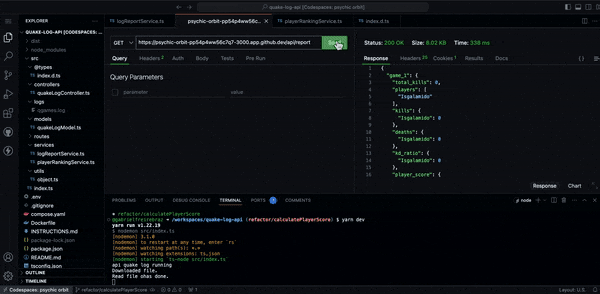

# API Quake Log

Project to parse the Quake log file.

## Tecnologies

- NodeJS 18.16.1 + Express 4.19.2 + Typescript 5.4.5
- Docker 24.0.9

## Get started

```bash 
yarn  
or
npm install
   
docker-compose up -d
```

## Endpoints

#### Game Report Request Route:

```
GET: http://{url}:3000/api/report     
```

#### Player Ranking Request Route:

```
GET: http://{url}:3000/api/ranking     
```
   
#### API Responses   


    
#### Player Ranking Response Route:  
  
```json
{
  "playerRanking": {
    "kills": {
      "Isgalamido": 147,
      "Zeh": 124,
      "Oootsimo": 114,
      "Assasinu Credi": 111,
      "Dono da Bola": 63,
      "Chessus": 33,
      "Mocinha": 0,
      "Maluquinho": 0,
      "Fasano Again": 0,
      "UnnamedPlayer": 0,
      "Chessus!": 0,
      "Mal": -3
    },
    "deaths": {
      "Fasano Again": 0,
      "Chessus!": 0,
      "UnnamedPlayer": 1,
      "Maluquinho": 1,
      "Mocinha": 2,
      "Chessus": 55,
      "Oootsimo": 127,
      "Isgalamido": 153,
      "Zeh": 173,
      "Mal": 178,
      "Dono da Bola": 189,
      "Assasinu Credi": 190
    },
    "kd_ratio": {
      "Isgalamido": 0.99,
      "Oootsimo": 0.91,
      "Zeh": 0.75,
      "Assasinu Credi": 0.62,
      "Chessus": 0.6,
      "Dono da Bola": 0.37,
      "Mal": 0.07,
      "Mocinha": 0,
      "Fasano Again": 0,
      "UnnamedPlayer": 0,
      "Maluquinho": 0,
      "Chessus!": 0
    },
    "player_score": {
      "Isgalamido": 156.9,
      "Zeh": 131.5,
      "Oootsimo": 123.1,
      "Assasinu Credi": 117.2,
      "Dono da Bola": 66.7,
      "Chessus": 39,
      "Mocinha": 0,
      "Maluquinho": 0,
      "Fasano Again": 0,
      "UnnamedPlayer": 0,
      "Chessus!": 0,
      "Mal": -2.3
    }
  }
}
```

#### Game Report Response Route:
  
```json
{
  "game_X": {
    "total_kills": 15,
    "players": [
      "Isgalamido",
      "Dono da Bola",
      "Mocinha",
      "Zeh"
    ],
    "kills": {
      "Mocinha": 0,
      "Dono da Bola": -1,
      "Zeh": -2,
      "Isgalamido": -4
    },
    "deaths": {
      "Dono da Bola": 1,
      "Mocinha": 2,
      "Zeh": 2,
      "Isgalamido": 10
    },
    "kd_ratio": {
      "Isgalamido": 0,
      "Dono da Bola": 0,
      "Mocinha": 0,
      "Zeh": 0
    },
    "player_score": {
      "Isgalamido": 0,
      "Dono da Bola": 0,
      "Mocinha": 0,
      "Zeh": 0
    }
  },
  "game_Y": {...}
}
```

  

# Quake Game Log API Business Documentation

This API has been developed to consume and analyze log information from Quake game matches. It enriches raw data with essential and relevant metrics that help better understand player performance during matches.

## API Features

The API provides a series of important indicators, tailored to the rules and context of each Quake championship. Our focus is to simplify access to fundamental information that is indispensable for game analysis.

#### Available Metrics per Match
  
For each match, we provide the following information and metrics:
  
- **Total Kills:** Total number of kills made during the match.
- **Players:** List of players who participated in the match.
- **Kills:** Number of kills by each player, ranked from highest to lowest.
- **Deaths:** Number of deaths by each player, ranked from lowest to highest.
- **KD Ratio:** Kill-to-death ratio, a common indicator in Quake, ranked by best performance.
- **Player Score:** Efficiency score calculated based on kills and KD Ratio, ranked by the player with the best score/performance.

#### Available Metrics Across Matches (Player Ranking)

In addition to the metrics from each individual match, the API also compiles an overall ranking of players throughout the tournament, allowing analyses of player evolution and consistency.

- **Kills:** List of players ranked by the highest number of kills across all matches.
- **Deaths:** List of players ranked by the fewest number of deaths across all matches.
- **KD Ratio:** List of players ranked by the best performance in the KD Ratio indicator across all matches.
- **Player Score:** List of players ranked by the best performance, taking into account the KD Ratio and the number of kills in all matches.
  
Using the available metrics across matches, it is possible to develop interfaces that display the individual ranking of each metric or even the player score, which is commonly used in tournaments.

<table>
<tr>
<td>

#### Player Ranking

</td>
<td>

#### Player Ranking K/D Ratio

</td>

</tr>
<tr>
<td>
  
| Ranking | Player | Kills | Deaths | KD Ratio | Score
| ----------- | ----------- | ----------- | ----------- | ----------- | ----------- |
| 1 | Isgalamido | 147 | 153 | 0.99 | 156.9
| 2 | Zeh | 124 | 173 | 0.75 | 131.5
| 3 | Oootsimo | 114 | 127 | 0.91 | 123.1
  
</td>
<td>
  
| Ranking | Player | K/D Ratio
| ----------- | ----------- | ----------- | 
| 1 | Isgalamido | 0.99
| 2 | Oootsimo | 0.91
| 3 | Zeh | 0.75
  
</td>
</tr>
</table>

## Ranking metrics 

#### K/D Ratio (Kill/Death Ratio)
  
The KD Ratio, or Kill/Death Ratio, is a common metric in competitive gaming, especially in shooters and real-time strategy games. It represents the ratio between the number of eliminations (kills) a player achieves and the number of times they are eliminated (deaths) in a match. 
  
A KD Ratio greater than 1 indicates that a player has eliminated more opponents than they have been eliminated, suggesting effective offensive performance. Conversely, a KD Ratio less than 1 may indicate that the player has been eliminated more often than they have managed to eliminate others, which could be a sign of struggle in the game.
  

#### Player Score (K/D Ratio+Kills)
  
The efficiency score, based on the KD Ratio and kills, is another important metric that helps evaluate a player's overall performance beyond just the number of eliminations and deaths. This score combines the KD Ratio with the total number of eliminations to produce a score that reflects both the effectiveness and aggressiveness of the player. For example, a player with many eliminations but also many deaths might have a moderate KD Ratio, but a high efficiency score due to the high number of eliminations, highlighting their significant impact and contribution to the matches. 
  
In our API, we use a weight of 10 in calculating this score to emphasize the value of eliminations, reflecting the importance of offensive actions within the game context. This weighting helps identify players who not only avoid being eliminated but also actively contribute to the team's success through offensive actions.

  

# Future Technical Implementations

- **Automated Testing:** Introducing automated testing is crucial in business contexts involving complex calculations and modular functionalities, such as this Quake log reading application, where data accuracy and integrity are essential. Testing ensures that features function correctly, minimizing failures. For effective implementation of these tests, tools like Jest and Vitest can be utilized.

- **API Authentication and Authorization:** To ensure that only authorized users access the API, it is essential to add an authentication header to each request. Using libraries such as JWT (JSON Web Tokens) is an effective practice for managing these authentications. Furthermore, integrating authentication with an API Gateway to issue authorization tokens and adopting advanced practices, such as using asymmetric keys, is crucial for maintaining access security.

- **Application Architecture:** In scenarios where data consumption occurs via streaming, such as the Quake game logs, it is advisable to adapt the application to an event-driven architecture to increase flexibility and scalability. This facilitates communication with microservices in clients operating under Single Page Applications (SPA) models, like React or Angular. This approach not only enhances efficiency in real-time data management but also supports easier expansion as new services or features are integrated.

- **Monitoring and Observability:** Initially, monitoring with the PM2 library may suffice to track request consumption. For larger contexts, it is recommended to implement tools like Sentry for error tracking and performance monitoring. Observability tools such as Prometheus, Grafana, or Datadog can be integrated to provide deeper insights into the application's health and performance.

- **Cloud Services:** It is advisable to deploy the application in a reliable, secure, and scalable server environment, such as a Linux instance on AWS EC2, which offers the flexibility to operate under varying load demands. Continuous monitoring of the application is essential to identify future needs and optimize costs. In addition to EC2, we are exploring cost-efficient serverless solutions, such as AWS Lambda, which charge based on usage. We are also considering the use of additional AWS services to support greater scale and data volume, such as S3 for log storage, RDS for database management, SQS for messaging, and DynamoDB for NoSQL storage solutions. This multifaceted approach ensures flexibility and scalability, adjusting to the evolving needs of the project.

- **Continuous Integration and Delivery (CI/CD):** Implementing continuous integration and delivery is essential to automate deployments. Utilizing tools like GitHub Actions to configure pipelines according to Gitflow branches, covering testing, staging, and production, optimizes the development and deployment process.

- **Load Balancer and API Clustering:** Implementing a load balancer using the Node.js PM2 library helps manage and balance traffic loads across application instances, making smarter use of CPUs. This facilitates horizontal scalability of the application on the same server, allowing Node.js's single-thread architecture to handle asynchronous request management more efficiently and make smarter use of available resources.

- **Infrastructure Security Layer:** Utilizing services like Cloudflare for content distribution (CDN) can significantly improve application latency for a richer user experience. Configuring DNS and TLS/SSL for end-to-end traffic reliability and including a firewall (WAF) helps manage this traffic more securely, identifying potential attacks before they reach the server, further protecting the server side of the application.

- **Caching Strategy:** The caching strategy can be implemented depending on the need for updates. For instance, in scenarios where information is processed and updated at the end of each tournament or daily at the end of the day. This would involve the use of a scheduling API, like the Node Schedule library, to update the database and store the new data in a caching persistence service, such as Redis or Node Cache, setting an average Time To Live (TTL) of 24 hours for each task. For situations that require immediate real-time updates, we can configure systems like Kafka to manage changes in log files along with the Web Server service and use web sockets for client-server communication through libraries like Socket.io. This last scenario may lead to high processing costs and it is essential to evaluate each use case individually to determine the most effective approach.